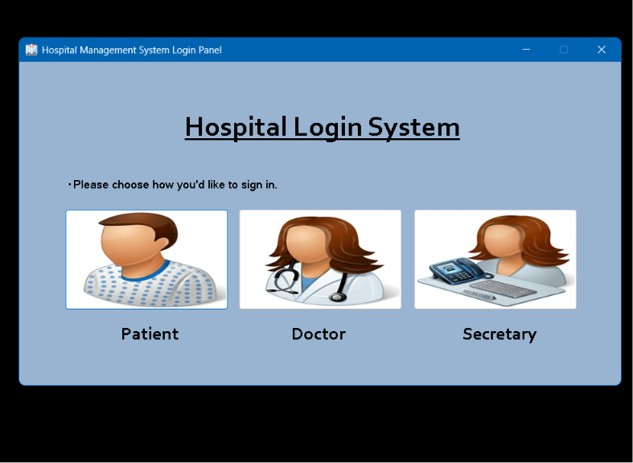
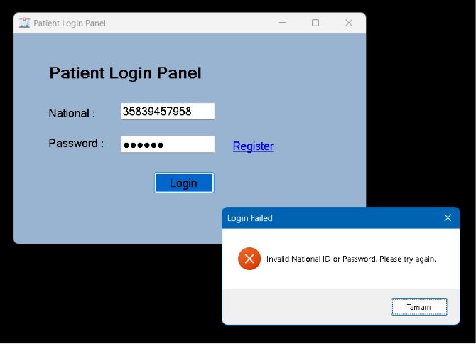
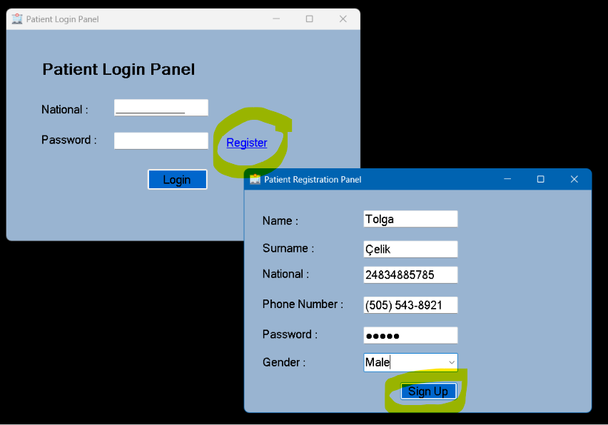
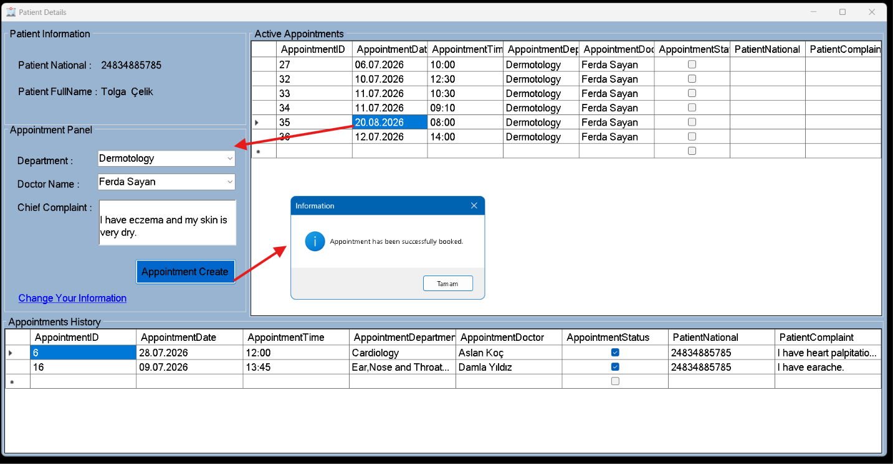
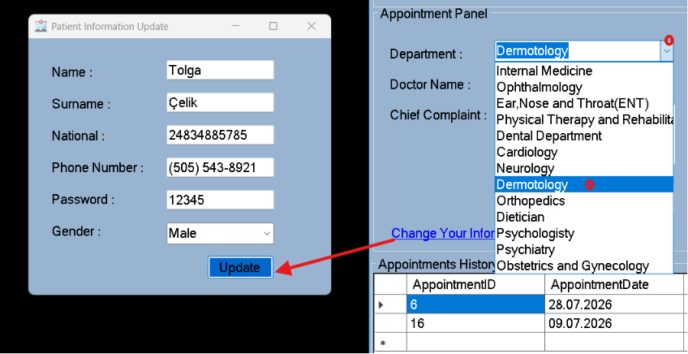
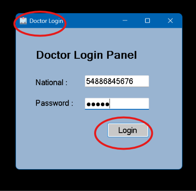
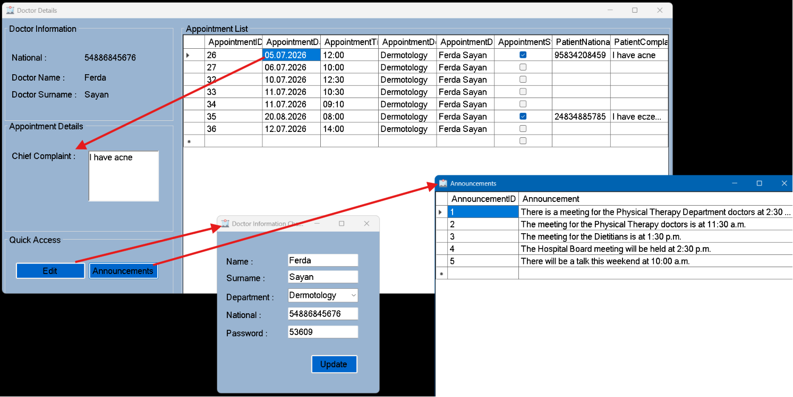
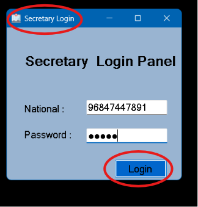
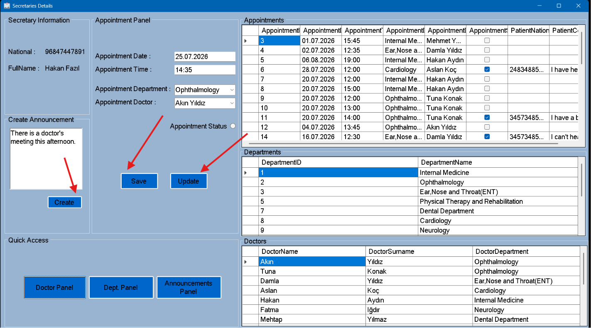
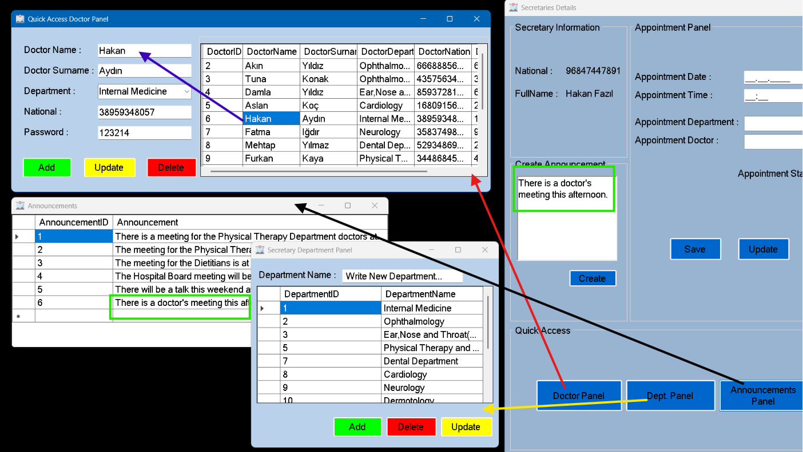

# HospitalManagementSystem
## This project is a system that allows a hospital's staff, doctors, and patients to view and manage their own information.

Technologies Used

The following technologies and tools were used in the development of this project:

C# (.NET): The primary programming language used to implement the application's functionality and business logic.
Windows Forms (WinForms): Used to create a user-friendly desktop interface.
Microsoft SQL Server: Used to securely store and manage data related to patients, doctors, secretaries, departments, and appointments.
ADO.NET (SqlDataReader, ExecuteReader): Used to connect the C# application to the SQL Server database and perform database operations.
Git & GitHub: Used for version control and source code management throughout the development process.

The system provides three separate user roles, each with its own login interface: secretaries, doctors, and patients.

Secretaries can manage announcements and appointments, as well as add, update, and maintain doctors, medical departments, and their relationships.
Patients can search for available appointments based on their preferred criteria. They can choose their preferred doctor and appointment time, then book the appointment directly through the system.
Doctors can view their schedules, including appointments that have been booked by patients as well as those that are still available. They can also access announcements relevant to them.

1-The images are actually buttons. Users click on the corresponding image to access the login page for their respective role.

2-The patient logs in by entering their ID number and password. If incorrect information is entered, the system displays a warning message.

3- If the patient does not have an account, they can click Register to create one.

4-After the patient successfully logs in, the Patient Details screen is displayed. In the Patient Information section, the patient's personal information is automatically loaded.

In the Appointment Panel, the patient selects the desired medical department and doctor. The Active Appointments section then instantly displays all available appointments that match the selected criteria. The patient chooses the most suitable appointment from the list.

Optionally, the patient can enter a brief description of their complaint or medical condition so that the doctor can review it before the appointment. By clicking the Create Appointment button, the patient successfully books the appointment.

The Appointment History section displays all of the patient's appointments. Whenever a new appointment is booked, it is automatically added to this section.

5-If the patient wants to update their personal information, they can click the "Change Your Information" link and edit their details.

6-The doctor opens the login screen by clicking the Doctor icon.

7-The doctor enters their ID number and password to log in to the system.

8-After the doctor logs in successfully, the Doctor Details page is displayed. The doctor's personal information is automatically loaded.
In the Appointment List section, the doctor can view only their own appointments. They can also see whether each appointment has been booked by a patient. When the doctor selects an appointment, if it has already been booked, the patient's complaint is displayed in the Chief Complaint section.

By clicking the Edit button, the doctor can update their personal information. The Edit window opens with the doctor's current information already filled in.
By clicking the Announcements button, the doctor can view all announcements posted by the secretary.

9-The secretary opens the login screen by clicking the Secretary icon.

10-The secretary enters their ID number and password to log in to the system.

11-After the secretary logs in successfully, the Secretary Details panel is displayed. The secretary's personal information is automatically loaded onto the page. The secretary can view all appointments, medical departments, and doctors in the system.

The secretary can create announcements and schedule new appointments. To create an appointment, the secretary selects the desired medical department and doctor, then enters the appointment date and time.

When the secretary selects a medical department, the Doctor dropdown automatically displays only the doctors who belong to that department. After entering the required information, the appointment is saved to the system by clicking the Save button.

The secretary can also select any appointment from the Appointments table. Once an appointment is selected, its details are automatically loaded into the corresponding fields. The secretary can then modify the information and click the Update button to save the changes.

12-Using the buttons at the bottom of the page, the secretary can access additional management panels.

The Announcements Panel allows the secretary to view all announcements in the system.

The Department Panel displays all medical departments. When a department is selected, its information is automatically filled into the corresponding text box. The secretary can update or delete the selected department using the available buttons. By entering the name of a new department and clicking the Add button, a new department is added to the system.

The Doctor Panel displays all registered doctors. The secretary can select a doctor to update or delete their information. The secretary can also register a new doctor by entering the required information and clicking the appropriate button.

